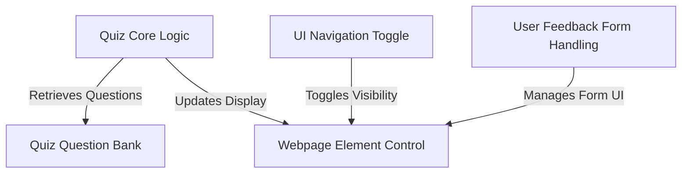
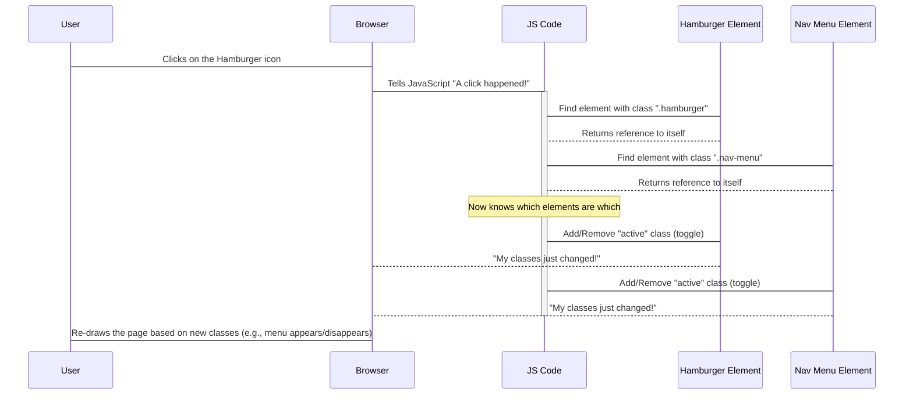
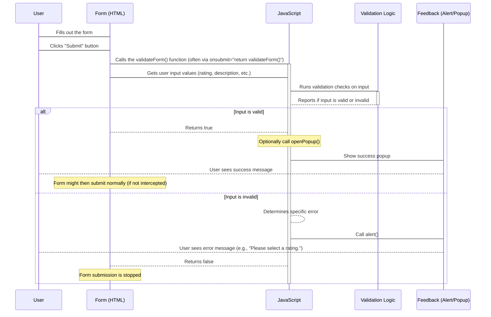
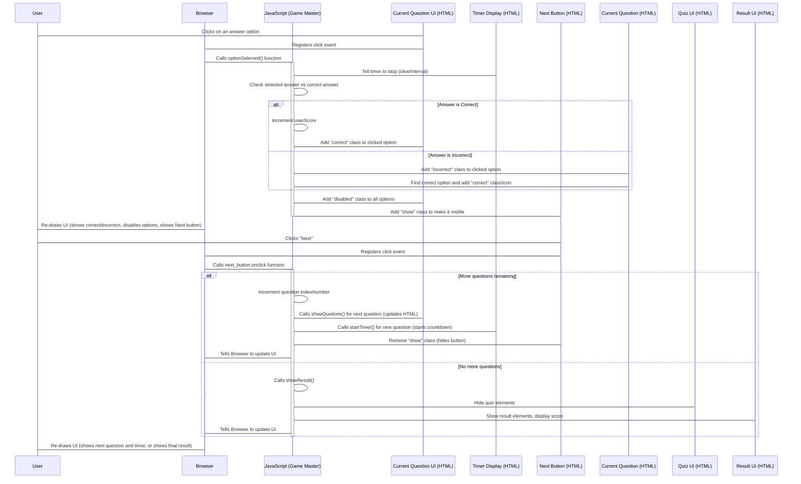
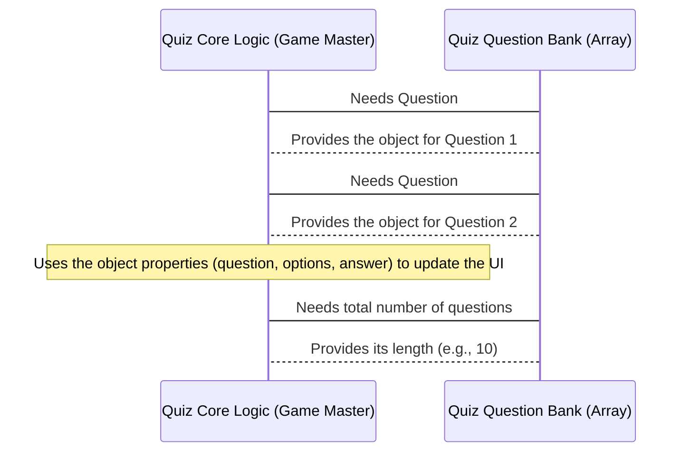
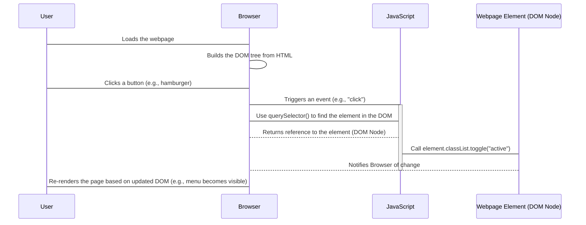

# Tutorial: Theatre-Web-Application

This project is a **web application** that offers users an interactive *quiz* on theatre-related topics. It also includes a section for users to provide *feedback* using a form. The application uses **JavaScript** to handle the quiz logic, manage the question data, validate the feedback form, and control how different parts of the **webpage** appear and behave, such as toggling the navigation menu on smaller screens.


## Visual Overview



## Chapters

1. [UI Navigation Toggle
](01_ui_navigation_toggle_.md)
2. [User Feedback Form Handling
](02_user_feedback_form_handling_.md)
3. [Quiz Core Logic
](03_quiz_core_logic_.md)
4. [Quiz Question Bank
](04_quiz_question_bank_.md)
5. [Webpage Element Control
](05_webpage_element_control_.md)

---

<sub><sup>Generated by [AI Codebase Knowledge Builder](https://github.com/The-Pocket/Tutorial-Codebase-Knowledge).</sup></sub>

# Chapter 1: UI Navigation Toggle

Welcome to the first chapter of our tutorial on the `Theatre-Web-Application` project! We're starting our journey by looking at a common and very useful feature in many websites: how to make the main menu behave nicely, especially on smaller screens like phones.

Have you ever visited a website on your phone and seen a little button, often with three horizontal lines (it looks a bit like a hamburger!), that you can tap to make a menu appear? And if you tap it again, the menu hides? That's exactly what "UI Navigation Toggle" is all about!

Think of your website's navigation menu like a secret compartment or a pull-out drawer. On a big desk (a large screen), you can leave the drawer open a bit so you can always see what's inside. But on a small bedside table (a small screen), you need to keep that drawer neatly closed to save space. The "hamburger" button is like the handle you pull to open or push to close the drawer.

**The Problem:** On smaller screens, showing the entire navigation menu all the time takes up too much valuable space.
**The Solution:** Hide the menu by default and provide a small button (the toggle) that, when clicked, reveals the menu. Clicking it again hides it. This "toggles" the menu's visibility.

This chapter will explain how our project handles this neat trick using a little bit of JavaScript code.

## How it Works at a High Level

To make this happen, we need our website to do a few things:

1.  **Identify the Actors:** Know which button is the toggle (the hamburger) and which part is the menu we want to show/hide.
2.  **Listen for the Action:** Pay attention to when the toggle button is clicked.
3.  **React to the Action:** When the button is clicked, change something about the menu (and maybe the button itself) so it becomes visible or hidden.

In our project, this is done using JavaScript code that interacts with the HTML elements on the page and uses CSS styles to control how things look.

## Looking at the Code

Let's look at the JavaScript code responsible for this. You'll find very similar code in files like `Student_2/navbar.js` and `Student_3/js/navbar.js`. Don't worry if you're new to JavaScript, we'll break it down step-by-step!

First, the code needs to find the hamburger button and the navigation menu on the webpage.

```javascript
const hamburger = document.querySelector(".hamburger")
const navMenu = document.querySelector(".nav-menu")
```

*   `document.querySelector(".hamburger")`: This line looks through the entire webpage (`document`) and finds the first element that has the CSS class `hamburger`. It then stores a reference to this element in a constant variable named `hamburger`.
*   `document.querySelector(".nav-menu")`: Similarly, this finds the element with the CSS class `nav-menu` (which is our navigation menu) and stores it in the `navMenu` variable.

So, these lines are like telling the computer, "Okay, remember these two specific things on the page, we'll need them."

Next, the code sets up the "listening" part:

```javascript
hamburger.addEventListener("click", () => {
  // ... code to run when clicked goes here ...
})
```

*   `hamburger.addEventListener("click", ...)`: This is telling the `hamburger` element, "Hey, please pay attention! If someone clicks on you, run the code inside the curly braces `{}`."

The `() => { ... }` part is a way to write a small function that will be executed *only* when the click happens.

Finally, inside that function (the part that runs when you click), we have the core "toggle" logic:

```javascript
hamburger.addEventListener("click", () => {
  hamburger.classList.toggle("active")
  navMenu.classList.toggle("active")
})
```

*   `hamburger.classList.toggle("active")`: Every HTML element has a list of CSS classes. This line looks at the list of classes for the `hamburger` element. If the class `active` is already there, it *removes* it. If the class `active` is *not* there, it *adds* it. It flips it back and forth!
*   `navMenu.classList.toggle("active")`: This does the exact same thing, but for the `navMenu` element.

So, when you click the hamburger:
1.  The `active` class is added to (or removed from) the hamburger button.
2.  The `active` class is added to (or removed from) the navigation menu.

You might wonder, "How does adding/removing a class make something appear or disappear?" This is where CSS comes in! There are separate CSS rules (usually in a `.css` file) that say things like:

*   "Normally, hide any element with the class `nav-menu` (like on small screens)."
*   "BUT, if an element has *both* the class `nav-menu` AND the class `active`, then *show* it!"

By toggling the `active` class using JavaScript, we're telling the browser which CSS rules to apply, which in turn changes whether the menu is visible or hidden.

## Under the Hood: The Sequence

Let's visualize what happens when a user clicks the hamburger icon, stepping through the process:



This diagram shows that the JavaScript code acts as a bridge: it waits for an event from the `Browser` (the click) and then tells the specific `Hamburger Element` and `Nav Menu Element` on the page to update their list of CSS classes. The `Browser` then automatically updates what the user sees based on those class changes defined in the CSS.

## Conclusion

In this first chapter, we explored the concept of UI Navigation Toggle. We learned that it's a way to manage screen space by hiding a navigation menu on small screens and using a button (like a hamburger icon) to reveal or hide it with a click. We saw how a few lines of JavaScript code find the necessary elements on the page and use `addEventListener` to listen for a `click`. When a click occurs, `classList.toggle("active")` is used to add or remove a specific CSS class, which then tells the browser how to display the elements according to the website's styles.

This simple interaction is a fundamental building block for creating responsive websites that work well on different devices.

Ready to move on? In the next chapter, we'll shift gears and look at how our application handles getting information *from* the user, specifically through a form: [User Feedback Form Handling](02_user_feedback_form_handling_.md).

---

<sub><sup>Generated by [AI Codebase Knowledge Builder](https://github.com/The-Pocket/Tutorial-Codebase-Knowledge).</sup></sub> <sub><sup>**References**: [[1]](https://github.com/Sehandu-Siriwardhana/Theatre-Web-Application/blob/da66dad2e08c074a954eb5a869a8dc650ee4fd96/Student_2/navbar.js), [[2]](https://github.com/Sehandu-Siriwardhana/Theatre-Web-Application/blob/da66dad2e08c074a954eb5a869a8dc650ee4fd96/Student_3/js/navbar.js)</sup></sub>

# Chapter 2: User Feedback Form Handling

Welcome back! In [Chapter 1: UI Navigation Toggle](01_ui_navigation_toggle_.md), we learned how our website can smartly hide and show the navigation menu to save space, especially on smaller screens. That was all about managing how the website *shows* information to the user.

Now, let's flip the script! What if we need to get information *from* the user? For example, after watching a theatre performance (or visiting the theatre's website!), the user might want to give feedback, like how they liked it and why. This is where a feedback form comes in.

The concept we're exploring in this chapter is **User Feedback Form Handling**.

Think of a feedback form like a special piece of paper you hand to someone. They fill it out, and then they hand it back to you. But before you accept it completely, you need to quickly check if they've filled out the important parts, right? Like, did they sign it? Did they answer the main questions? If something is missing or doesn't look right, you might gently tell them, "Hey, could you please fill this part out?"

**The Problem:** Just putting a form on a website isn't enough. Users might forget to fill in a required box, or maybe type something that doesn't make sense. If we just accept whatever they send, the feedback we get might be incomplete or useless.
**The Solution:** We need a process to:
1.  **Gather the Information:** Let the user type or select their feedback.
2.  **Validate the Input:** Check if the user has filled out the necessary parts correctly before they "submit" the form.
3.  **Provide Feedback:** Tell the user if there was a problem (e.g., "You forgot to select a rating!") or if everything was successful (e.g., "Thanks for your feedback!").

This chapter will show you how our project uses JavaScript to act like that helpful receptionist, making sure the feedback form is filled out properly and giving the user immediate feedback.

## How it Works at a High Level

To handle a feedback form, our website needs to:

1.  **Know the Form:** Identify the specific parts of the form we care about (like the rating options, the comment box).
2.  **Wait for Submission:** Pay attention to when the user tries to send the form.
3.  **Check the Answers (Validate):** When the user tries to submit, run some checks on the information they've provided.
4.  **Decide What to Do:**
    *   If everything looks good, let the form submission process continue (or do something else, like show a thank you message).
    *   If something is missing or wrong, stop the submission and tell the user what they need to fix.
5.  **Show Messages:** Use simple alerts or pop-up boxes to communicate with the user.

In our project, JavaScript is used to perform the validation checks and display messages, interacting with the HTML form elements.

## Looking at the Code

Let's look at the JavaScript code responsible for this. You'll find relevant code in files like `Student_2/form.js`. We'll focus on the `validateForm` function and the functions for showing messages.

First, let's look at the core logic for checking the form:

```javascript
function validateForm() {
  // 1. Get the information the user entered

  // Check if a rating is selected
  var ratingSelected = false;
  // ... code to check ratings ...

  // Check if description is filled
  var description = document.getElementsByName("description")[0].value;
  // ... code to check description ...

  // 2. If something is missing, show a message and STOP
  if (!ratingSelected) {
    alert("Please select a rating."); // Show a simple message
    return false; // Stop the form submission
  }

  if (description.trim() === "") {
    alert("Please provide a description."); // Show another message
    return false; // Stop the form submission
  }

  // 3. If we reach here, the form is valid!
  // Form is valid, allow submission (or do something else)
  return true;
}
```

*   `function validateForm() { ... }`: This defines a block of code named `validateForm` that we can call whenever we need to check the form.
*   `// 1. Get the information ...`: Inside the function, the code first needs to get the values the user entered into the form fields. It uses `document.getElementsByName(...)` to find form elements by their `name` attribute (like `rating` or `description`) and then gets their `value`.
*   `// 2. If something is missing ...`: This is the validation part. The `if` statements check if the conditions for a valid form are met. For example, `!ratingSelected` means "if a rating was *not* selected".
*   `alert("Please select a rating.");`: If a validation check fails, this line pops up a small box in the browser showing the message inside the quotes.
*   `return false;`: This is crucial! If `validateForm` returns `false`, the form *will not* be submitted. This stops the process until the user fixes the error.
*   `// 3. If we reach here ... return true;`: If none of the `if` checks failed, it means the form is valid. The function returns `true`, which allows the form submission to proceed.

Let's look a bit closer at how it checks if a rating is selected (ratings are often done with radio buttons, where only one can be chosen):

```javascript
function validateForm() {
  var rating = document.getElementsByName("rating"); // Get all elements named "rating" (radio buttons)
  var ratingSelected = false; // Assume no rating is selected initially

  // Loop through each rating option
  for (var i = 0; i < rating.length; i++) {
    if (rating[i].checked) { // Check if this specific rating option is ticked
      ratingSelected = true; // Found a selected rating!
      break; // No need to check the others
    }
  }

  // ... rest of the validation (check description, etc.) ...

  if (!ratingSelected) {
    alert("Please select a rating.");
    return false;
  }

  // ... rest of the function ...
}
```

*   `document.getElementsByName("rating")`: This gets a list of all the HTML elements (likely radio buttons) that have the name `rating`.
*   `for (var i = 0; i < rating.length; i++) { ... }`: This loop goes through each item in the list of rating elements.
*   `rating[i].checked`: Inside the loop, this checks if the current rating element (`rating[i]`) has been selected by the user.
*   `ratingSelected = true; break;`: If a selected rating is found, we set `ratingSelected` to `true` and `break` out of the loop because we've found what we needed.

And checking the description is simpler:

```javascript
function validateForm() {
  // ... get rating ...

  var description = document.getElementsByName("description")[0].value; // Get the value from the description text area

  // ... check rating ...

  if (description.trim() === "") { // Check if the description is empty (after removing leading/trailing spaces)
    alert("Please provide a description.");
    return false;
  }

  // ... rest of the function ...
}
```

*   `document.getElementsByName("description")[0].value`: We get the element named `description` (assuming there's only one, hence `[0]`) and then get its `value` (what the user typed).
*   `description.trim() === ""`: `trim()` removes any spaces from the beginning or end of the text the user typed. We then check if the result is an empty string (`""`). If it is, they didn't type anything useful.

Finally, besides the simple `alert` messages for errors, the project might also use pop-ups for other purposes, like showing a success message after a valid submission (although the provided snippet shows opening/closing the pop-up, the logic to tie it to successful validation might be elsewhere).

```javascript
function openPopup(){
  let popup = document.getElementById("popup"); // Find the HTML element for the popup
  popup.classList.add("open-popup"); // Add a CSS class to make it visible
}

function closePopup(){
  let popup = document.getElementById("popup"); // Find the popup element again
  popup.classList.remove("open-popup"); // Remove the CSS class to hide it
}
```

*   `document.getElementById("popup")`: Finds an HTML element that has the specific `id` "popup". This is likely the container for the pop-up message.
*   `popup.classList.add("open-popup")`: Similar to [Chapter 1: UI Navigation Toggle](01_ui_navigation_toggle_.md), this adds a CSS class (`open-popup`) to the element. CSS rules then define what "open" looks like (e.g., visible, centered on the screen).
*   `popup.classList.remove("open-popup")`: Removes the class, likely causing the CSS rules to hide the element again.

These functions (`openPopup`, `closePopup`) would be called by other parts of the JavaScript code – perhaps after `validateForm` returns `true`, or when the user clicks a button on the pop-up itself to close it.

## Under the Hood: The Sequence

Let's visualize what happens when a user tries to submit the form:



This diagram shows that the HTML `Form` works closely with the `JavaScript`. When the user attempts to submit, the form is configured to hand off control to the `validateForm` function in JavaScript. JavaScript then performs the checks (the `Validation Logic`) and, based on the result, either allows the submission (`return true`) or stops it (`return false`) and shows a message to the `User` using `Feedback` mechanisms like `alert` or a custom `Popup`.

## Conclusion

In this chapter, we explored the concept of User Feedback Form Handling. We learned that it's about getting information *from* the user reliably by adding validation checks to a web form. We saw how JavaScript can be used to:
1.  Get the data the user entered.
2.  Check if required fields (like ratings or descriptions) are filled out using functions like `validateForm`.
3.  Stop the form from submitting if the input is invalid by returning `false`.
4.  Provide feedback to the user using simple `alert()` messages or custom pop-ups controlled by adding/removing CSS classes, similar to how we handled the navigation toggle in [Chapter 1: UI Navigation Toggle](01_ui_navigation_toggle_.md).

This process is essential for collecting clean, usable data from your website visitors and guiding them on how to fill out forms correctly.

Ready for something different? In the next chapter, we'll dive into the fun world of quizzes and look at the core logic that powers them: [Quiz Core Logic](03_quiz_core_logic_.md).

---

<sub><sup>Generated by [AI Codebase Knowledge Builder](https://github.com/The-Pocket/Tutorial-Codebase-Knowledge).</sup></sub> <sub><sup>**References**: [[1]](https://github.com/Sehandu-Siriwardhana/Theatre-Web-Application/blob/da66dad2e08c074a954eb5a869a8dc650ee4fd96/Student_2/form.js)</sup></sub>

# Chapter 3: Quiz Core Logic

Welcome back, future web developers!

In [Chapter 1: UI Navigation Toggle](01_ui_navigation_toggle_.md), we learned how to make parts of our website appear and disappear smartly, like hiding a menu on small screens. In [Chapter 2: User Feedback Form Handling](02_user_feedback_form_handling_.md), we tackled getting information *from* the user through forms and making sure it's valid.

Now, let's move to something a bit more interactive and fun: a quiz!

Have you ever played an online quiz? You start, a question appears, you pick an answer, you see if you were right, your score updates, and then you move to the next question until you finish and see your final score. All of this flow and all these rules – that's the job of the **Quiz Core Logic**.

Think of the Quiz Core Logic as the **"Game Master"** for our quiz. It's not concerned with *what* the questions are (we'll cover that in the next chapter!), but rather *how* the game is played:

*   Starting the game.
*   Presenting one question at a time.
*   Listening for your answer.
*   Checking if your answer is correct.
*   Keeping track of how many answers you got right (your score!).
*   Keeping an eye on the clock (a timer for each question!).
*   Moving you to the next question.
*   Ending the game and showing your final result.

**The Problem:** Building a quiz isn't just about showing questions. We need a system to manage the entire game flow, react to user input, and enforce rules like time limits.
**The Solution:** The Quiz Core Logic is an abstraction (a set of code working together) that handles this central game management. It uses JavaScript to control which elements are visible, respond to clicks, keep score, and manage the timer.

This chapter will guide you through the main parts of this "Game Master" code in our project.

## How it Works at a High Level

To act as the Game Master, our JavaScript code needs to perform these key actions:

1.  **Setup:** Get references to the important parts of the webpage (like the start button, the instruction box, the quiz area, the result area, the question area, the options list, the timer).
2.  **Start:** When the user clicks the "Start Quiz" button, hide the starting screen/instructions and show the main quiz area.
3.  **Show Question:** Display the current question and its answer options on the page.
4.  **Handle Answer:** When a user clicks on an answer option:
    *   Stop the timer for that question.
    *   Check if the selected answer matches the correct answer.
    *   Update the score if correct.
    *   Visually indicate whether the answer was correct or incorrect (and show the correct answer if the user was wrong).
    *   Disable clicking on other options for that question.
    *   Show the "Next Question" button.
5.  **Timer:** Start a countdown for each question. If the time runs out before the user answers, treat it as a wrong answer and show the correct one.
6.  **Next Question/End:** When the user clicks the "Next Question" button (or time ran out):
    *   If there are more questions, move to the next one and repeat steps 3-5.
    *   If there are no more questions, end the quiz and show the result screen.
7.  **Show Result:** Hide the quiz area and display the result area with the final score.
8.  **Restart/Quit:** Provide options to play again or exit.

All of this logic is managed by functions and variables in a single JavaScript file, keeping track of the current question number, the user's score, and the timer state.

## Looking at the Code

Let's look at the JavaScript code responsible for being our Quiz Game Master. You'll find this logic primarily in `Student_3/js/script.js`.

First, like in previous chapters, we need to find the different parts of our HTML page that we want to control.

```javascript
// assigning variables
const start_button = document.querySelector(".start_button button");
const ins_box = document.querySelector(".ins_box");
const quiz_box = document.querySelector(".quiz_box");
const result_box = document.querySelector(".result_box");
const option_list = document.querySelector(".option_list");
const timeCount = document.querySelector(".timer .timer_sec");
const next_button = document.querySelector(".next_button");
// ... and many more variables ...
```

*   These lines use `document.querySelector` (or `document.getElementById`, not shown here but also possible) to find specific elements on the webpage based on their CSS class or ID. We store references to these elements in constant variables (`const`) so we can easily control them later in the code.

Next, let's see how the quiz starts and how the first question is shown.

```javascript
// when start button is clicked
start_button.onclick = ()=>{
    ins_box.classList.add("activeInfo"); // Shows instruction box
    // ... some code to blur the background ...
}

// when continue button is clicked (usually on the instructions)
continue_button.onclick = ()=>{
    //hides instruction box
    ins_box.classList.remove("activeInfo");
    //show quiz box
    quiz_box.classList.add("activeQuiz");
    // Start the game flow!
    showQuetions(0); // Show the FIRST question (index 0)
    queCounter(1); // Update the question counter display
    startTimer(6); // Start the timer for the first question
}
```

*   The first part listens for a click on the `start_button`. It doesn't start the quiz yet, but shows the instructions (`ins_box`). This is a common pattern: Start -> Instructions -> Actual Start.
*   The `continue_button` (found inside the instruction box) is where the *actual* quiz game logic kicks off.
*   `ins_box.classList.remove("activeInfo")` and `quiz_box.classList.add("activeQuiz")`: This is similar to the navigation toggle! It uses CSS classes to hide the instructions and show the quiz area.
*   `showQuetions(0)`: This is a function call that will take the question at index `0` (the first question) and display it.
*   `queCounter(1)`: This function updates the text at the bottom of the quiz box to show "1 of X Questions".
*   `startTimer(6)`: This function begins the countdown, setting the time to 6 seconds for this question.

Now, let's look at the `showQuetions` function:

```javascript
// getting questions from array (the array is defined elsewhere, see next chapter!)
function showQuetions(index){
    const que_text = document.querySelector(".que_text");
    const option_list = document.querySelector(".option_list"); // Get option list here too

    // Assuming 'questions' is an array of question objects like:
    // { numb: 1, question: "...", answer: "...", options: ["...", ...] }

    // Build the HTML for the question text
    let que_tag = '<span>'+ questions[index].numb + ". " + questions[index].question +'</span>';

    // Build the HTML for the options
    let option_tag = '<div class="option"><span>'+ questions[index].options[0] +'</span></div>'
    + '<div class="option"><span>'+ questions[index].options[1] +'</span></div>'
    + '<div class="option"><span>'+ questions[index].options[2] +'</span></div>'
    + '<div class="option"><span>'+ questions[index].options[3] +'</span></div>';

    // Put the generated HTML onto the webpage
    que_text.innerHTML = que_tag;
    option_list.innerHTML = option_tag;

    // Make each option clickable by attaching an event listener (simplified)
    const options = option_list.querySelectorAll(".option");
    for(let i=0; i < options.length; i++){
        options[i].setAttribute("onclick", "optionSelected(this)"); // Call optionSelected when clicked
    }
}
```

*   `showQuetions(index)`: This function takes the `index` of the question we want to show from a list (array) of questions (we'll discuss the `questions` array in [Chapter 4: Quiz Question Bank](04_quiz_question_bank_.md)).
*   It finds the HTML elements where the question text (`.que_text`) and options (`.option_list`) should go.
*   It builds HTML strings (`que_tag`, `option_tag`) using the data from the `questions` array at the given `index`.
*   `innerHTML = ...`: This replaces the content of the HTML elements with the new question and options HTML.
*   `options[i].setAttribute("onclick", "optionSelected(this)")`: This is a way to make each answer option clickable. When an option is clicked, it calls the `optionSelected` function, passing a reference to the clicked option element (`this`).

What happens when an option is clicked? The `optionSelected` function takes over!

```javascript
// if user clicked on option
function optionSelected(answerElement){
    clearInterval(counter); // Stop the timer!
    // clearInterval(counterLine); // Stop the timer animation line too

    let userAns = answerElement.textContent; // Get the text the user clicked
    let correcAns = questions[que_count].answer; // Get the correct answer for the current question

    const allOptions = option_list.children.length; // How many options are there?

    // --- Checking the answer and updating UI ---
    if(userAns == correcAns){
        userScore += 1; // Increase the score!
        answerElement.classList.add("correct"); // Add green background
        // answerElement.insertAdjacentHTML("beforeend", tickIconTag); // Add tick icon
        console.log("Correct Answer! Score:", userScore);
    } else {
        answerElement.classList.add("incorrect"); // Add red background
        // answerElement.insertAdjacentHTML("beforeend", crossIconTag); // Add cross icon
        console.log("Wrong Answer!");

        // --- Auto-show the correct answer ---
        for(let i=0; i < allOptions; i++){
            if(option_list.children[i].textContent == correcAns){
                // option_list.children[i].setAttribute("class", "option correct"); // Add green to correct one
                // option_list.children[i].insertAdjacentHTML("beforeend", tickIconTag); // Add tick to correct one
                console.log("Correct answer shown.");
            }
        }
    }

    // --- After any option is selected ---
    // Disable all options so user can't click again for this question
    for(let i=0; i < allOptions; i++){
        option_list.children[i].classList.add("disabled");
    }
    // Show the Next button
    next_button.classList.add("show");
}
```

*   `optionSelected(answerElement)`: This function receives the specific option element that the user clicked.
*   `clearInterval(counter)`: Stops the timer immediately. The user answered before time ran out!
*   It compares the text content of the clicked option (`userAns`) with the `correcAns` from the `questions` array for the *current* question (`questions[que_count]`).
*   `userScore += 1`: If correct, the `userScore` variable is increased. This variable keeps track of the score throughout the quiz.
*   `answerElement.classList.add(...)`: Adds CSS classes (`correct` or `incorrect`) to the clicked option to change its appearance (usually background color) based on whether the answer was right or wrong.
*   The code also loops through all options to find the *correct* one and visually marks it (even if the user chose wrong), helping the user learn.
*   `option_list.children[i].classList.add("disabled")`: This loop goes through *all* the options and adds a `disabled` class, preventing the user from clicking any other option for this question after they've made their choice.
*   `next_button.classList.add("show")`: Adds a CSS class to the "Next" button to make it visible.

After an answer is selected (either by the user or by time running out), the "Next" button appears. What happens when *that* is clicked?

```javascript
// when next que button is clicked
next_button.onclick = ()=>{
    // Check if there are more questions left
    if(que_count < questions.length - 1){
        que_count++; // Move to the next question index
        que_numb++; // Increment the displayed question number
        showQuetions(que_count); // Load and display the next question
        queCounter(que_numb); // Update the question counter display
        clearInterval(counter); // Clear any previous timer
        // clearInterval(counterLine); // Clear timer line too
        startTimer(timeValue); // Start the timer for the new question
        timeText.textContent = "Time Left"; // Reset timer text
        next_button.classList.remove("show"); // Hide the Next button again
    } else {
        // No more questions!
        clearInterval(counter); // Stop the final timer
        // clearInterval(counterLine); // Stop the timer line
        showResult(); // Call the function to display the results
    }
}
```

*   `next_button.onclick = ()=>{ ... }`: This code runs when the "Next" button is clicked.
*   `if(que_count < questions.length - 1)`: Checks if the current question index (`que_count`) is less than the index of the last question (`questions.length - 1`). If true, there are more questions.
*   `que_count++`, `que_numb++`: Increments the counters to move to the next question.
*   `showQuetions(que_count)`, `queCounter(que_numb)`, `startTimer(timeValue)`: Calls the functions we discussed earlier to load the next question, update the counter, and start the timer for it.
*   `next_button.classList.remove("show")`: Hides the "Next" button again until the user selects an answer for the *new* question.
*   `else { showResult(); }`: If the `if` condition is false (meaning `que_count` is already at the last question's index), it calls the `showResult` function to finish the quiz.

Finally, the `showResult` function:

```javascript
//result
function showResult(){
    ins_box.classList.remove("activeInfo"); // Hide instructions (just in case)
    quiz_box.classList.remove("activeQuiz"); // Hide the quiz area
    result_box.classList.add("activeResult"); // Show the result area

    const scoreText = result_box.querySelector(".result_score");

    // Build the message based on the user's final score
    let scoreTag = '<span>You got <p>'+ userScore +'</p> out of <p>'+ questions.length +'</p> Questions</span>';

    // Add a congratulatory/encouraging message based on score
    if (userScore > 3){ // Example threshold
        scoreTag = '<span>and congrats! , You got <p>'+ userScore +'</p> out of <p>'+ questions.length +'</p></span>';
    } else if(userScore > 1){ // Another example threshold
        scoreTag = '<span>and nice , You got <p>'+ userScore +'</p> out of <p>'+ questions.length +'</p></span>';
    } else {
        scoreTag = '<span>and sorry , You got only <p>'+ userScore +'</p> out of <p>'+ questions.length +'</p></span>';
    }

    scoreText.innerHTML = scoreTag; // Display the final score message
    // (Code for Restart/Quit buttons would be here or elsewhere)
}
```

*   `showResult()`: This function is called when the quiz is over.
*   It uses `classList.remove` and `classList.add` to hide the quiz elements and show the elements for the result screen, just like we did for the instructions and quiz start.
*   It finds the element where the score text should be displayed (`.result_score`).
*   It creates an HTML string (`scoreTag`) that includes the final `userScore` and the total number of questions (`questions.length`).
*   It uses `if/else if/else` to customize the message based on how well the user did.
*   `scoreText.innerHTML = scoreTag`: Displays the final message on the page.

The timer logic (`startTimer`) uses `setInterval` to repeatedly call a function that decreases the time count. If time hits zero, it stops the timer and automatically processes the question as unanswered/wrong, showing the correct answer and the "Next" button. This adds pressure and excitement to the quiz!

## Under the Hood: The Sequence

Let's visualize a single round of the quiz game when a user answers a question before time runs out:



This diagram shows how the JavaScript code orchestrates the entire game flow. It reacts to clicks (`optionSelected`, `next_button.onclick`), updates the visual elements on the page (`Current Question UI`, `Timer Display`, `Next Button`), manages the game state (like `userScore`, current question index), and handles time limits.

## Internal Implementation Details

As we've seen, the `Quiz Core Logic` relies on several key pieces working together:

*   **Variables:** Global variables like `que_count` (index of current question in the array), `que_numb` (the question number displayed to the user, starting from 1), `userScore`, `timeValue` (seconds on the timer), and `counter` (to control the `setInterval` for the timer). These variables hold the state of the game.
    ```javascript
    let timeValue = 6; // Starting time for each question
    let que_count = 0; // Current question index (starts at 0)
    let que_numb = 1; // Current question number (starts at 1)
    let userScore = 0; // User's score
    let counter; // Variable to hold the timer ID
    // ... other variables for UI elements ...
    ```
    These are the game's memory!

*   **UI Control:** Functions like `showQuetions()` and `showResult()`, and the click handlers for buttons, use `element.classList.add()` and `element.classList.remove()` to swap between different screens (instructions, quiz, results) or show/hide elements (like the Next button). This is exactly the same technique we saw in [Chapter 1: UI Navigation Toggle](01_ui_navigation_toggle_.md) for controlling visibility.

*   **Event Handling:** Using `element.onclick = (...) => { ... }` or `element.addEventListener('click', ...)`, the code waits for the user to interact with the page (clicking start, continue, an answer option, or next).

*   **Timer:** The `startTimer()` function is a crucial part of the game logic.
    ```javascript
    function startTimer(time){
        counter = setInterval(timer, 1000); // Call the 'timer' function every 1000ms (1 second)
        function timer(){
            timeCount.textContent = time; // Update the displayed time
            time--; // Decrease the time

            if(time < 0){ // If time runs out
                clearInterval(counter); // Stop the timer
                timeText.textContent = "Time Off"; // Change text
                // (Logic to automatically select the correct answer and show Next button goes here)
                // This prevents the user from interacting after time is up
                 next_button.classList.add("show"); // Show Next button
            }
        }
    }
    ```
    `setInterval` is a built-in browser function that repeatedly runs a piece of code at a set interval (here, every 1000 milliseconds). `clearInterval` is used to stop it.

*   **Score Keeping:** The `userScore` variable is updated within the `optionSelected` function whenever a correct answer is chosen. It's then used in `showResult` to display the final score.

## Conclusion

In this chapter, we explored the **Quiz Core Logic**, understanding it as the "Game Master" that controls the flow and rules of the quiz. We saw how JavaScript manages the entire game:
1.  Starting the quiz and displaying the first question using `showQuetions`.
2.  Handling user answers in `optionSelected`, checking correctness, updating the `userScore`, modifying the UI, and enabling the "Next" button.
3.  Moving through questions or ending the quiz based on the logic in the `next_button.onclick` handler.
4.  Showing the final score using `showResult`.
5.  Implementing a per-question `startTimer` using `setInterval`.

We also saw how techniques from previous chapters, like using CSS classes to control element visibility (from [Chapter 1: UI Navigation Toggle](01_ui_navigation_toggle_.md)), are reused here to switch between different quiz screens.

This core logic is powered by managing variables that store the game's state and reacting to user events. But where do the actual questions come from? That's what we'll explore in the next chapter: [Quiz Question Bank](04_quiz_question_bank_.md).

---

<sub><sup>Generated by [AI Codebase Knowledge Builder](https://github.com/The-Pocket/Tutorial-Codebase-Knowledge).</sup></sub> <sub><sup>**References**: [[1]](https://github.com/Sehandu-Siriwardhana/Theatre-Web-Application/blob/da66dad2e08c074a954eb5a869a8dc650ee4fd96/Student_3/js/script.js)</sup></sub>

# Chapter 4: Quiz Question Bank

Welcome back! In our last chapter, [Chapter 3: Quiz Core Logic](03_quiz_core_logic_.md), we got to know the "Game Master" for our quiz. We learned how the code manages the flow: starting the quiz, showing questions, checking answers, keeping score, and handling the timer.

But the Quiz Core Logic doesn't *know* the questions itself. It's like a quiz show host who has a stack of question cards. The host knows *how* to run the show (read the question, listen to the answer, check the back of the card for correctness), but the actual questions and answers are written *on the cards*.

This chapter is all about those "question cards"! We're going to look at the **Quiz Question Bank**.

Think of the Quiz Question Bank as a special *library* or *database* that holds *all* the quiz content. It's not active; it just *stores* information. The Quiz Core Logic goes to this library and says, "Okay, give me question number 1," or "Now give me question number 5."

**The Problem:** We need a structured place to store all the questions, their possible answers, and the correct answer for each, separate from the logic that runs the quiz.
**The Solution:** We store the questions in a specific data structure (an array of objects in JavaScript) that's easy for the Quiz Core Logic to access and use. This is our Quiz Question Bank.

## How it Works at a High Level

The Quiz Question Bank is simply a collection of information. In programming, a common way to store a collection of similar items is using an **array**. An array is just a list of things, ordered one after another (like items on a shopping list or players on a team).

Each item in our quiz bank list is one single question. What information do we need for *one* question?

*   The question itself (the text).
*   A list of possible answers (the options the user can choose from).
*   Which of those possible answers is the correct one.

So, our Quiz Question Bank is an array where each element in the array holds all this information for *one* question.

The Quiz Core Logic knows the order of the questions (by their position in the array) and asks for them one by one.

## Looking at the Code

Let's look at the code that creates this question bank. You'll find this in `Student_3/js/questions.js`.

```javascript
// creating an array and passing the question number, questions, options, and answers
let questions = [
    // Question 1 (index 0)
    {
    numb: 1,
    question: "Who is considered the King of Pop?",
    answer: "Michael Jackson",
    options: [
      "Michael Jordan",
      "Elvis Presley",
      "Michael Jackson",
      "Frank Sinatra"
    ]
  },
  // ... more questions follow ...
];
```

*   `let questions = [ ... ];`: This line declares a variable named `questions` and sets it equal to an array (`[]`). The array contains several items inside the square brackets, separated by commas. Each item is a question.
*   `// Question 1 (index 0)`: Arrays in programming start counting from 0. So the *first* item is at index 0, the second at index 1, and so on. This comment reminds us that the first item in the list is question number 1, but its position (index) in the array is 0.

Now let's look closely at just *one* of those question items inside the array:

```javascript
// This is one item (an "object") inside the 'questions' array
{
  numb: 1,
  question: "Who is considered the King of Pop?",
  answer: "Michael Jackson",
  options: [
    "Michael Jordan",
    "Elvis Presley",
    "Michael Jackson",
    "Frank Sinatra"
  ]
}
```

This format `{ ... }` is called an **object** in JavaScript. An object is a way to group related pieces of information together, using `name: value` pairs.

*   `numb: 1`: This stores the display number for the question (Question 1).
*   `question: "Who is considered the King of Pop?"`: This stores the text of the question.
*   `answer: "Michael Jackson"`: This stores the *correct* answer text. This text *must exactly match* one of the options in the `options` list.
*   `options: [ ... ]`: This is another array! This array contains all the possible answer choices that will be shown to the user.

So, each item in the main `questions` array is an object that neatly packages all the details needed for one quiz question.

How does the Quiz Core Logic (from [Chapter 3: Quiz Core Logic](03_quiz_core_logic_.md)) use this bank? It accesses the questions using their index (position) in the `questions` array.

For example, to get the first question (index 0):

```javascript
let firstQuestion = questions[0];
console.log(firstQuestion.question); // Output: "Who is considered the King of Pop?"
console.log(firstQuestion.options); // Output: ["Michael Jordan", "Elvis Presley", "Michael Jackson", "Frank Sinatra"]
console.log(firstQuestion.answer); // Output: "Michael Jackson"
```

*   `questions[0]`: This selects the object at the first position (index 0) in the `questions` array.
*   `.question`, `.options`, `.answer`: These are how you access the specific pieces of information (the "properties") *inside* that question object.

In the `showQuetions(index)` function from Chapter 3, the code used the `index` parameter to get the specific question object from the `questions` array and then used `.question` and `.options` to display them.

```javascript
// From showQuetions(index) in Chapter 3:
let que_tag = '<span>'+ questions[index].numb + ". " + questions[index].question +'</span>';
// ... building options using questions[index].options ...
```

And in the `optionSelected(answerElement)` function from Chapter 3, it used the current question's index (`que_count`) to find the correct answer:

```javascript
// From optionSelected in Chapter 3:
let correcAns = questions[que_count].answer; // Get the correct answer for the current question
```

This shows how the core logic relies entirely on the structure and content of the `questions` array (our Quiz Question Bank) to get the information it needs to run the game.

## Under the Hood: Data Structure

The core of the Quiz Question Bank is its data structure. It's simply an array of objects.

Let's visualize how the Quiz Core Logic interacts with this bank:



The `Quiz Question Bank` doesn't *do* anything; it just holds the data. The `Quiz Core Logic` is the active part that *requests* data from the bank based on the current question number and uses that data to manage the quiz flow.

This structure makes it very easy to:

*   **Add more questions:** Just add another object `{ ... }` to the `questions` array.
*   **Change questions:** Edit the text, options, or answer within an existing question object.
*   **Reorder questions:** Change the order of the objects in the array.

The Quiz Core Logic code doesn't need to change much, if at all, when you update the questions, because it's designed to work with *any* array of question objects that follow this format.

## Conclusion

In this chapter, we uncovered the secret source of the quiz content: the **Quiz Question Bank**. We learned that it's implemented as a JavaScript array named `questions`, where each item in the array is an object containing the `numb`, `question`, `answer`, and `options` for a single question.

This structure is crucial because it keeps the quiz content separate from the quiz logic, making it easy to manage, update, and expand the quiz by simply modifying the `questions` array. The Quiz Core Logic relies on accessing information from this array using the question's index.

We've now seen how the quiz runs and where it gets its questions. What's left? Making sure the code can actually *show* and *hide* things on the webpage based on the quiz state. That's the job of **Webpage Element Control**, which we'll explore in the next chapter.

[Chapter 5: Webpage Element Control](05_webpage_element_control_.md)

---

<sub><sup>Generated by [AI Codebase Knowledge Builder](https://github.com/The-Pocket/Tutorial-Codebase-Knowledge).</sup></sub> <sub><sup>**References**: [[1]](https://github.com/Sehandu-Siriwardhana/Theatre-Web-Application/blob/da66dad2e08c074a954eb5a869a8dc650ee4fd96/Student_3/js/questions.js)</sup></sub>

# Chapter 5: Webpage Element Control

Welcome back to our tutorial series on the `Theatre-Web-Application` project!

In our previous chapters, we've explored different pieces of the application:
*   [Chapter 1: UI Navigation Toggle](01_ui_navigation_toggle_.md) showed us how to make a navigation menu appear and disappear.
*   [Chapter 2: User Feedback Form Handling](02_user_feedback_form_handling_.md) taught us how to check the information a user puts into a form.
*   [Chapter 3: Quiz Core Logic](03_quiz_core_logic_.md) dived into the "Game Master" code that runs our quiz.
*   [Chapter 4: Quiz Question Bank](04_quiz_question_bank_.md) revealed where the quiz gets its questions from.

Notice something? All of these features, from showing a menu to displaying a question or a score, rely on changing what the user *sees* on the webpage. How does our JavaScript code actually *do* that?

This chapter introduces the fundamental concept behind all those visual changes: **Webpage Element Control**.

Imagine a stage play. The director (our JavaScript code) needs to tell the actors (the HTML elements on the webpage, like buttons, text areas, boxes) what to do: "Go on stage!" (make visible), "Change your costume!" (change appearance/style), "Say this line!" (change text). Webpage Element Control is the director's way of giving instructions to these actors.

**The Problem:** A static HTML page just sits there. To make it interactive, dynamic, or responsive (like showing/hiding things or updating information), we need a way for our code to reach into the page and modify its parts.
**The Solution:** JavaScript provides tools to **find** specific elements within the webpage's structure (the Document Object Model, or DOM) and then **change** their properties, content, or appearance.

This chapter will show you the basic JavaScript tools used throughout the project to select and control these webpage elements.

## How it Works at a High Level

At its core, controlling webpage elements involves two main steps:

1.  **Finding the Element:** Pinpointing the specific part of the HTML page you want to interact with. Is it the main menu? The submit button? The area where the quiz question text goes?
2.  **Manipulating the Element:** Once you've found it, doing something to it. This could be:
    *   Changing the text it displays.
    *   Changing its visual style (color, size, whether it's visible).
    *   Changing its behavior (like enabling or disabling a button).

JavaScript uses special built-in functions and properties to perform these steps.

## Looking at the Code: The Basic Tools

We've already seen these tools in action in earlier chapters! Let's revisit some examples and highlight the core techniques.

### Tool 1: Finding Elements

The most common way to find an element is using `document.querySelector()`. This is like asking the browser, "Please find me the *first* element on the page that matches this description (like a CSS selector)."

```javascript
// From Student_2/navbar.js or Student_3/js/navbar.js
const hamburger = document.querySelector(".hamburger");
const navMenu = document.querySelector(".nav-menu");

// From Student_2/form.js
// Finds the element with the ID "popup"
let popup = document.getElementById("popup");

// From Student_3/js/script.js
// Finds the element with the class "start_button" and then looks inside it for a "button" element
const start_button = document.querySelector(".start_button button");
```

*   `document.querySelector(".hamburger")`: Finds the first element with the CSS class `hamburger`.
*   `document.getElementById("popup")`: Finds the element with the specific ID `popup`. This is often faster than `querySelector` if you know the ID.
*   `document.querySelector(".start_button button")`: Finds a `button` element that is *inside* an element with the class `start_button`. This shows `querySelector` can use more complex CSS selectors.

There's also `document.getElementsByName()`, which finds *all* elements with a specific `name` attribute (like radio buttons or input fields in a form):

```javascript
// From Student_2/form.js
// Finds ALL elements with the name "rating" (returns a list)
var rating = document.getElementsByName("rating");
// Finds ALL elements with the name "description" and gets the FIRST one [0]
var descriptionInput = document.getElementsByName("description")[0];
```

Once you find an element, you store it in a variable (`const` or `let`) so you can easily refer to it and control it later.

### Tool 2: Controlling Appearance and Behavior (`classList`)

One of the most powerful and common ways to change an element's look and feel is by adding or removing CSS classes. Your CSS file already defines what elements with certain classes should look like (e.g., `.activeInfo` might mean "display block" or "position absolutely and show"). JavaScript just needs to toggle these classes on the element.

This is done using the `classList` property of an element, which gives you access to methods like `add()`, `remove()`, and `toggle()`.

```javascript
// From Student_2/navbar.js or Student_3/js/navbar.js (Chapter 1)
// If "active" is there, remove it. If not, add it.
hamburger.classList.toggle("active");
navMenu.classList.toggle("active");

// From Student_2/form.js (Chapter 2)
// Adds the "open-popup" class to make the popup visible
popup.classList.add("open-popup");
// Removes the "open-popup" class to hide the popup
popup.classList.remove("open-popup");

// From Student_3/js/script.js (Chapter 3)
// Shows the instruction box
ins_box.classList.add("activeInfo");
// Hides the quiz box
quiz_box.classList.remove("activeQuiz");
// Disables clicking on an option after it's selected
answer.classList.add("disabled");
```

As you can see, `classList.add()`, `.remove()`, and `.toggle()` are used repeatedly throughout the project to control which elements are visible and how they are styled, simply by applying CSS rules defined elsewhere.

### Tool 3: Controlling Content (`textContent`, `innerHTML`)

Sometimes you don't just want to change an element's style; you want to change the actual text or HTML *inside* it.

*   `textContent`: Changes the text content of an element, ignoring any HTML tags within it.
*   `innerHTML`: Changes the HTML content of an element. This is more powerful as you can insert new HTML tags, but be careful when using it with user-provided input to avoid security issues.

```javascript
// From Student_3/js/script.js (Chapter 3)
const que_text = document.querySelector(".que_text"); // Area for question text
const option_list = document.querySelector(".option_list"); // Area for options list

// Assuming que_tag and option_tag contain HTML strings
que_text.innerHTML = que_tag; // Puts the question HTML into the question area
option_list.innerHTML = option_tag; // Puts the options HTML into the options area

// Also from Student_3/js/script.js (Chapter 3)
const timeCount = document.querySelector(".timer .timer_sec"); // Area for timer text
timeCount.textContent = time; // Updates the text displayed for the timer count

// From Student_3/js/script.js (Chapter 3)
const scoreText = result_box.querySelector(".result_score"); // Area for score text
scoreText.innerHTML = scoreTag; // Puts the final score HTML into the score area
```

`innerHTML` is used heavily in the quiz to load the question text and answer options dynamically. `textContent` is used for simpler cases like just updating the number on the timer.

These three sets of tools (`querySelector`/`getElementById`/`getElementsByName`, `classList`, `textContent`/`innerHTML`) are the workhorses of Webpage Element Control in this project. They allow JavaScript to interact with the HTML page and make it come alive.

## Under the Hood: The DOM

When a browser loads an HTML page, it doesn't just read the text; it builds a tree-like structure in its memory called the **Document Object Model (DOM)**. Every HTML tag (like `<div>`, `<p>`, `<button>`) becomes a "node" or "element" in this tree.

JavaScript interacts with this DOM. When you use `document.querySelector('.my-class')`, JavaScript is searching through this tree structure to find the node that matches the selector. Once it finds the node, the variables you create (like `const navMenu = ...`) are references to that specific node in the DOM tree.

Then, when you call methods like `navMenu.classList.toggle('active')` or `que_text.innerHTML = '...'`, JavaScript is directly modifying that node in the browser's DOM tree. The browser is constantly watching the DOM for changes, and when it detects one, it automatically updates what you see on the screen.

Let's visualize this interaction simply:



This sequence shows that JavaScript acts as the intermediary, receiving events from the browser (like clicks) and then using its tools to find and modify the elements (the nodes) in the browser's internal model of the page (the DOM). The browser then takes care of updating the visual display for the user.

## Internal Implementation Details

The code snippets shown above are the core implementation details for controlling elements. There isn't a single complex "abstraction" function *called* "Webpage Element Control". Instead, it's a pattern of using these fundamental JavaScript tools (`querySelector`, `classList`, `innerHTML`/`textContent`) repeatedly whenever the code needs to interact with the visual page.

Here's a summary of how the project uses these tools, drawing from the provided code:

| Action Needed                     | How it's Done                                        | JavaScript Tool Used                 | Examples from Project                                                                 |
| :-------------------------------- | :--------------------------------------------------- | :----------------------------------- | :------------------------------------------------------------------------------------ |
| Find a specific part of the page  | Select it using CSS selectors or IDs/Names           | `document.querySelector()`           | `.hamburger`, `.nav-menu`, `.quiz_box button`                                         |
|                                   | Select it using a specific ID                        | `document.getElementById()`          | `#popup`                                                                              |
|                                   | Select elements by their HTML `name` attribute       | `document.getElementsByName()`       | `"rating"`, `"description"`                                                           |
| Change whether an element is seen | Add or remove CSS classes that control `display`     | `element.classList.add()`            | `quiz_box.classList.add("activeQuiz")`                                                |
|                                   | Add or remove CSS classes that control `display`     | `element.classList.remove()`         | `ins_box.classList.remove("activeInfo")`                                              |
|                                   | Flip a CSS class on/off                            | `element.classList.toggle()`         | `hamburger.classList.toggle("active")`                                                |
| Change the text/HTML inside       | Replace the contents with new text or HTML structure | `element.innerHTML = '...';`       | `que_text.innerHTML = que_tag;` (for question/options)                                |
|                                   | Replace the contents with just text                  | `element.textContent = '...';`     | `timeCount.textContent = time;` (for timer)                                           |
| Change an element's appearance    | Add CSS classes that change colors, borders, etc.    | `element.classList.add()`            | `answer.classList.add("correct")` (marking correct/incorrect quiz answer)           |
| Change an element's behavior      | Add CSS classes that disable interaction (`pointer-events: none;`) | `element.classList.add()`            | `option_list.children[i].classList.add("disabled")` (disabling options after answer) |

These simple methods are the building blocks for all the dynamic updates you see on the webpage.

## Conclusion

In this chapter, we've explored the fundamental concept of **Webpage Element Control**. We learned that it's the process by which JavaScript finds specific parts of the HTML page (elements) using methods like `document.querySelector()` and then modifies them.

The primary ways we've seen this modification happen in our project are:
*   Controlling visibility and general appearance by adding or removing CSS classes using `element.classList.add()`, `.remove()`, and `.toggle()`.
*   Updating the text or HTML content displayed inside an element using `element.textContent` or `element.innerHTML`.

These techniques, while simple individually, are powerful when combined and used in response to user actions or changes in application state (like moving to the next quiz question or validating a form). They are the bridge between our JavaScript logic and the visual presentation that the user sees and interacts with.

This concludes our conceptual overview of the key parts of the `Theatre-Web-Application`. You now have a foundational understanding of how navigation toggles work, how forms are handled, the logic behind the quiz, where the quiz questions come from, and most importantly, how JavaScript controls the very elements that make up the webpage.

We hope this tutorial has been a helpful starting point for understanding this project!

---

<sub><sup>Generated by [AI Codebase Knowledge Builder](https://github.com/The-Pocket/Tutorial-Codebase-Knowledge).</sup></sub> <sub><sup>**References**: [[1]](https://github.com/Sehandu-Siriwardhana/Theatre-Web-Application/blob/da66dad2e08c074a954eb5a869a8dc650ee4fd96/Student_2/form.js), [[2]](https://github.com/Sehandu-Siriwardhana/Theatre-Web-Application/blob/da66dad2e08c074a954eb5a869a8dc650ee4fd96/Student_2/navbar.js), [[3]](https://github.com/Sehandu-Siriwardhana/Theatre-Web-Application/blob/da66dad2e08c074a954eb5a869a8dc650ee4fd96/Student_3/js/navbar.js), [[4]](https://github.com/Sehandu-Siriwardhana/Theatre-Web-Application/blob/da66dad2e08c074a954eb5a869a8dc650ee4fd96/Student_3/js/script.js)</sup></sub>
